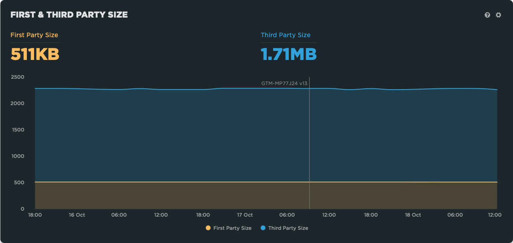

# GTM Watcher

Add a note to a SpeedCurve site when a GTM container is changed



## Background

Although Google Tag Manager (GTM) can send notifications when a container is changed, it only supports email so can't send a notifcation to SpeedCurve, Slack or other applications that support WebHooks.

GTM Watcher regularly fetches one or more GTM containers and if a container's version has changed it adds a note to SpeedCurve via the API.


## Getting Started

1. Fork the repository

2. Add the SpeedCurve authorisation string as a repository secret called `SPEEDCURVE_AUTH`

   This can be generated via https://support.speedcurve.com/reference/getting-started#basic-authentication and should be similar to `Basic YXNkYXNkYXNkOno=`

3. Edit .github/worklows/update.yml

  - Configure a Schedule (either remove the # to run hourly, or add your own)

```yaml
on:
  workflow_dispatch:
  schedule:
#    - cron:  '0 */1 * * *'
```

  - Add the ID's of one or more containers you'd like to monitor (it's the ID on the end of this request https://www.googletagmanager.com/gtm.js?id=GTM-XXX)

```yaml
env:
  # Space separated list of GTM container IDs to check
  GTM_IDS: GTM-XXX GTM-YYY
```

  - Add the ID of the SpeedCurve Site you'd like to save the notes against

   The relevant site id can be retrieved via SpeedCurve's API [https://support.speedcurve.com/reference/get-all-sites-1](https://support.speedcurve.com/reference/get-all-sites-1)

```yaml
  # ID of SpeedCurve site see https://support.speedcurve.com/reference/get-all-sites-1
  SPEEDCURVE_SITE_ID: xxxxxx
```

4. Commit the Changes

The action should now start running and update SpeedCurve when the container(s) change.

There will be a false notification the first time the action but this can be deleted using Settings in SpeedCurve


## Notes

The action extracts the version number as even though the overall contents of a container seem to remain the same, the order of configuration rules seems non-deterministic and changes from fetch to fetch!

The version numbers are stored in the versions folder, and the containers in containers – both these folders will be created on first run. 

The containers are kept in-case you want to view the raw changes but it's probably easier to use GTM's UI instead

If should be relatively straightforward to change the action to support other webhooks e.g. Slack, or monitor other scripts, although any scripts you want to monitor should have consistent URLs (some experimentation tools generate a filename with a hash in for each revision).

Hopefully one day someone on the GTM team will add support for notifications via WebHooks and make this repo redundant.

## Acknowledgements

Inspired by [Simon Willison's](https://github.com/simonw) experiments with [Git Scraping](https://simonwillison.net/2020/Oct/9/git-scraping/)


## License

Copyright Andy Davies 2022

MIT Licensed, do with this what you want!
